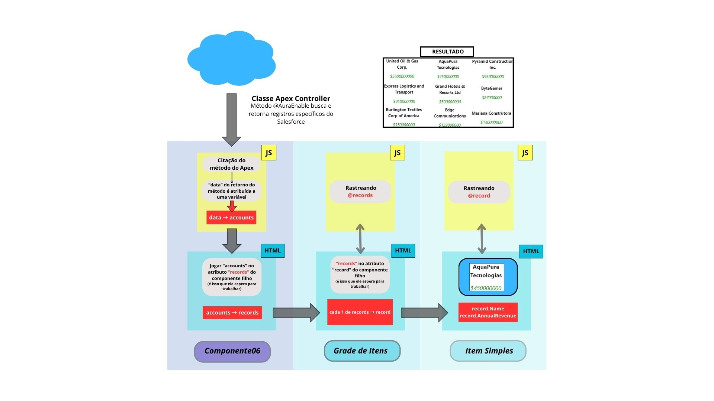

## Tarefas antes de desenvolver o componente

a) Como os dados serão "puxados" da org?  
b) Que componente receberá os dados manipuláveis?  
c) O que cada componente vai fazer?
d) Que informações cada componente precisa para trabalhar?  

a) *Como os dados serão capturados da org?* 
Classe Apex **Account Controller**  

b) *Que componente receberá os dados manipuláveis?*  
Componente pai **Componente10ManipularDadosApex** 

a) *O que cada componente vai fazer?*  
*Componente10ManipularDadosApex*: Receber os registros via Apex 
*Grade de Itens*: Exibir os registros  
*Item Simples*: Exibir os campos "Name" e "AnnualRevenue" de cada registro   

d) *Que informações cada componente precisa para trabalhar?*  
*Componente10ManipularDadosApex*: Coleção de registros do Apex  
*Grade de Itens*: Coleção de registros  
*Item Simples*: Registro e campos "Name" e "AnuualRevenue" 