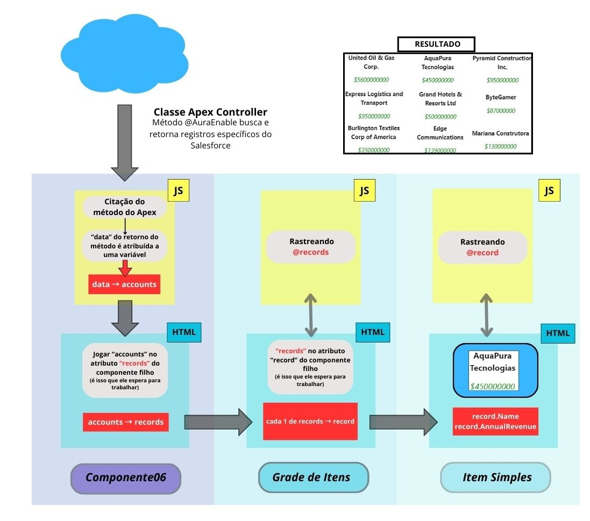

## Tarefas antes de desenvolver o componente

• Decidir como os dados serão capturados da org. (geralmente classe Apex)
• Que componente receberá os dados manipuláveis?
• Que informações cada componente precisa para trabalhar?

